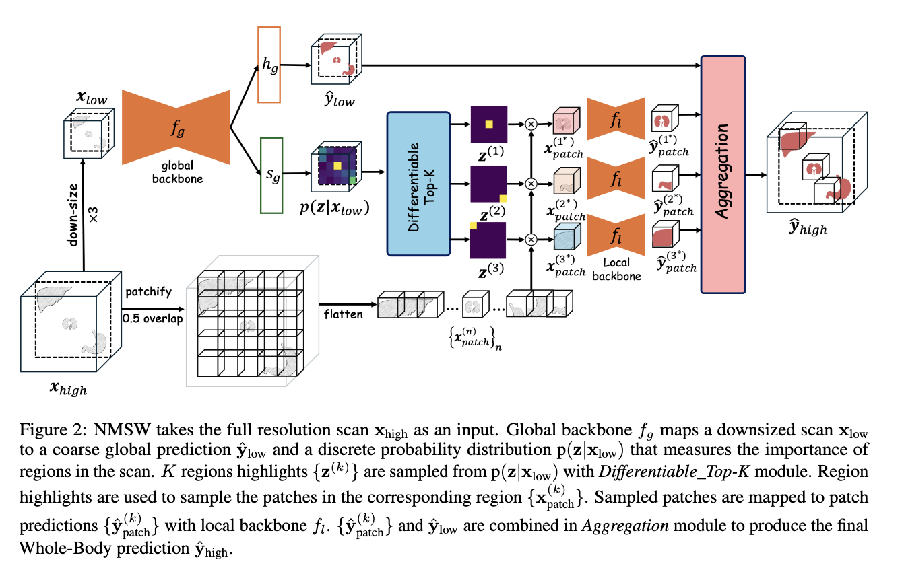
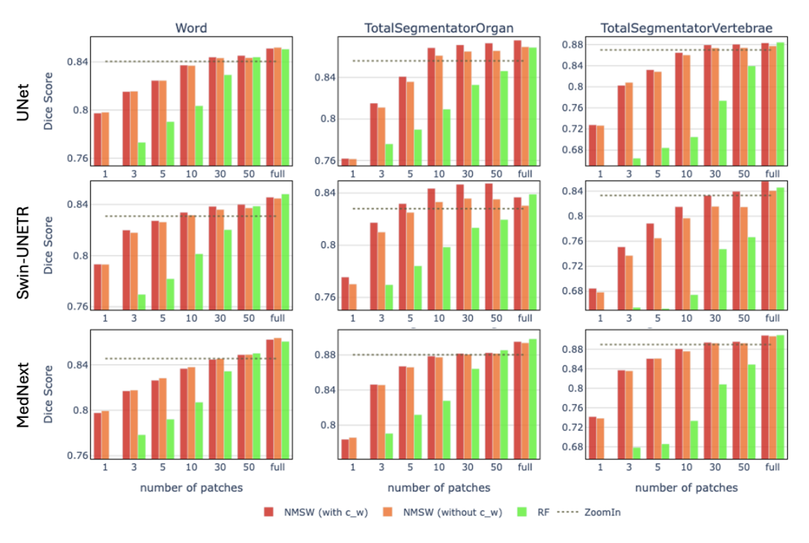
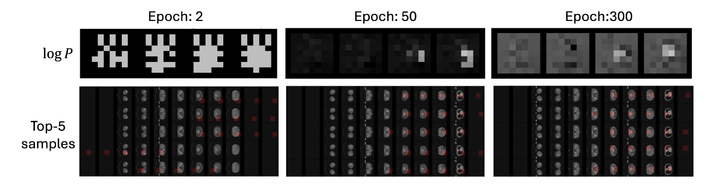

## NO MORE SLIDING WINDOW: EFFICIENT 3D MEDICAL IMAGE SEGMENTATION WITH DIFFERENTIABLE TOP-K PATCH SAMPLING

We introduce, for the first time in the community, a computationally efficient full-res CT/MRI segmentation framework, called the No-More-Sliding-Window (NMSW) which replaces the costly SW inference with a differentiable patch sampling module that learns to sample only a handful of patches of higher importance. NMSW aggregates the predictions from the selected patches with a low-res global prediction to produce the final full-res whole-volume prediction.

## Model Summary



## Results
NMSW compared with other inference techniques. RF(full) is identical to Sliding Window (SW).



Visualization of learning patch sampling distribution


## **Environmental Setup**

```
# clone the project
git clone [this/git/url]

#add python path
PYTHONPATH=[your/local/project/dir]

#Install conda env
conda create -n nmsw python=3.11 -y

#install requirements
pip install -r requirements.txt
```

## Data Preparation

- Download Word dataset via followling links:
    - [WORD](https://github.com/HiLab-git/WORD)
- move data to  `[your/project/dir]/data/datasets/processed` and rename the dataset to `Word`

## Run Experiments

- To train NMSW and baselines
    - note that training local and global are enough as the baselines only differ by sampling stretegy but share same local and global weights

```
# nmsw
python train-test.py \
    model=NSWNet3D \
    dataset_name=Word \
    gpu_id=0 \
    ++model.local_backbone_name=FasterUNet \
    ++model.num_train_topk_patches=4\
    ++model.num_train_random_patches=1\

# local
python train-test.py \
    model=LocalSeg3D \
    dataset_name=Word \
    gpu_id=0 \
    ++model.local_backbone_name=FasterUNet \
    ++model.num_patches=5

# global
python train-test.py \
    model=GlobalSeg3D \
    dataset_name=Word \
    gpu_id=0 \
    ++model.global_backbone_name=FasterUNet    
```

- To evaluate NMSW and baselines

```bash
# nmsw
python train-test.py \
    model=NSWNet3D \
    dataset_name=Word \
    gpu_id=0 \
    ++model.num_infernce_patches=[5/30/300]\
    ckpt_path=[your/checkpoint/path]\

# baseline:s_w
python train-test.py \
    model=GlobalLocalSeg3D \
    dataset_name=Word \
    gpu_id=0 \
    ++model.sampling_stretegy.sampling_stretegy=s_w\
    ++model.local_backbone_name=FasterUNet\
    ++model.global_backbone_name=FasterUNet\
    ++model.local_ckpt_path=[your/checkpoint/path]\
    ++model.global_ckpt_path=[your/checkpoint/path]
    
# baseline:random_fg
python train-test.py \
    model=GlobalLocalSeg3D \
    dataset_name=Word \
    gpu_id=0 \
    ++model.num_infernce_patches=[5/30/300]\
    ++model.sampling_stretegy.sampling_stretegy=random_fg\
    ++model.local_backbone_name=FasterUNet\
    ++model.global_backbone_name=FasterUNet\
    ++model.local_ckpt_path=[your/checkpoint/path]\
    ++model.global_ckpt_path=[your/checkpoint/path]

# baseline:zoom_out
python train-test.py \
    model=GlobalLocalSeg3D\
    dataset_name=Word\
    gpu_id=0\
    ++model.sampling_stretegy.sampling_stretegy=zoom_in\
    ++model.local_backbone_name=FasterUNet\
    ++model.global_backbone_name=FasterUNet\
    ++model.local_ckpt_path=[your/checkpoint/path]\
    ++model.global_ckpt_path=[your/checkpoint/path]
            
```